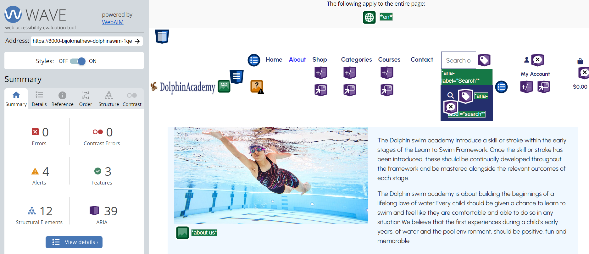

# Dolphin Swim Academy


[View live site](https://dolphinswimacademy.herokuapp.com/)

This olphin Swim Academy online shopping application built using Django, stripe and allows customer to register and do online shopping. Customer can purchase the swimming costumes as well as reserve swimming classes by using this website. Administrator of the academy can also able to do the product management like add, modify and delete product.Aslo the same action can do for swimming courses. Customers can contact to the academy by using the website.It is the fifth project in the Code institute Full Stack Developer program.

** For testing payment with this site please use the following card details:**

A regular user has been setup with the username of testcustomer1 and password of 2testpassword2

+ When making a payment as a regular user, a test credit card of 4242424242424242 has been set up for the card number
For the expiry date, cvc and postal code any series number(s) can be used(once they meet the mimimum values)

## Table of Content

- [Dolphin Swim Academy](#dolphin-swim-academy)
  - [Table of Content](#table-of-content)
- [User Experience](#user-experience)
  - [Strategy](#strategy)
    - [Site Owner Goals](#site-owner-goals)
    - [User Goals](#user-goals)
    - [Target Audience](#target-audience)
  - [User Requirements and Expectations](#user-requirements-and-expectations)
  - [Business Model](#business-model)
  - [SEO](#seo)
  - [Marketing](#marketing)
    - [Facebook Business Page](#facebook-business-page)
  - [Structure](#structure)
    - [Code Structure](#code-structure)
    - [Database](#database)
      - [Physical database model](#physical-database-model)
      - [Models](#models)
        - [User Model](#user-model)
        - [UserProfile Model](#userprofile-model)
        - [Product Model](#product-model)
        - [Category Model](#category-model)
        - [Size Model](#size-model)
        - [Inventory Model](#inventory-model)
        - [Course Model](#course-model)
        - [Contact Model](#contact-model)
    - [Scope](#scope)
      - [**Product Backlog**](#product-backlog)
    - [User stories:](#user-stories)
      - [Error Flow](#error-flow)
    - [Design](#design)
      - [Wireframes](#wireframes)
      - [Colours](#colours)
      - [Typography](#typography)
  - [Features](#features)
    - [Home page](#home-page)
      - [Header and navigation bar](#header-and-navigation-bar)
      - [Search bar](#search-bar)
      - [Image carousel](#image-carousel)
      - [Footer](#footer)
    - [Products](#products)
      - [All products](#all-products)
      - [Product details](#product-details)
      - [Sorting products](#sorting-products)
      - [Page order](#page-order)
      - [Pagination](#pagination)
      - [Create product](#create-product)
      - [Update product](#update-product)
      - [Deleting a product](#deleting-a-product)
      - [Categories](#categories)
      - [Inventory management](#inventory-management)
    - [Courses](#courses)
      - [Course list](#course-list)
      - [Course details](#course-details)
      - [Update courses](#update-courses)
      - [Add courses](#add-courses)
      - [Delete courses](#delete-courses)
    - [Log in](#log-in)
    - [Log out](#log-out)
    - [Register](#register)
    - [Profile page](#profile-page)
      - [Profile information](#profile-information)
      - [Order history](#order-history)
    - [Shopping Cart](#shopping-cart)
      - [Shopping cart](#shopping-cart-1)
      - [Checkout](#checkout)
    - [Contact](#contact)
    - [About](#about)
    - [Administration](#administration)
    - [Messages](#messages)
  - [Future Features](#future-features)
  - [Technologies Used](#technologies-used)
    - [Languages](#languages)
      - [Python Libraries](#python-libraries)
    - [Frameworks \& Tools](#frameworks--tools)
  - [Validation](#validation)
    - [HTML Validation](#html-validation)
    - [CSS Validation](#css-validation)
    - [JS Validation](#js-validation)
    - [Py Validation](#py-validation)
      - [Admin py-validation](#admin-py-validation)
      - [Models py validation](#models-py-validation)
      - [Views py validation](#views-py-validation)
    - [Accessibility](#accessibility)
    - [Performance](#performance)
  - [Testing](#testing)
    - [Manual Testing](#manual-testing)
    - [Testing user stories](#testing-user-stories)
  - [Fixed Issues](#fixed-issues)
  - [Remaining Issues](#remaining-issues)
- [Gmail and Stripe configuration](#gmail-and-stripe-configuration)
  - [Google emails](#google-emails)
  - [Stripe](#stripe)
- [Deployment](#deployment)
  - [Amazon WebServices](#amazon-webservices)
  - [Local Deployment](#local-deployment)
  - [Heroku and Postgres Database](#heroku-and-postgres-database)
  - [Credits](#credits)
    - [Media](#media)
    - [Acknowledgements:](#acknowledgements)

# User Experience
## Strategy

### Site Owner Goals

The primary goal of the website from the site owners perspective is as follows:
- To enable customers to purchase products listed on the site
- To allow a user to navigate the website and view product details
- To allow a user to create an account & log in to an existing account
- To allow a user to view their order history and account details
- To allow users to view the course and able to reserve the course
- To be able to edit, add and remove products from the site

### User Goals

- The primary goal of the website from a site users perspective is as follows:
- To view products and product details
- To easily search for products
- To filter products based on price, category etc
- To register for an account
- To log into/out of an existing account
- To add a product to bag and purchase order
- To be able to view order history
- To contact the site owner

### Target Audience

- Swimming enthusiasts
- Active people
- People who want to learn swimming
- Qualified swimmers and trainers
  
[Return to Table of Contents](#table-of-content)
  
## User Requirements and Expectations

- An easy navigation system with instant learning.
- Able to navigate the site quickly and easily.
- No broken links.
- Responsive and visually appealing on all devices.
- Ability to view products and complete purchases
- Ability to contact the business

## Business Model

For this project, as the primary goal is to sell products direct to consumers. Add all products with image and detailed descriptions, ability to search and ease to purchase, a product inventory with out of stock visibilty, and restrictions on purchasing more items than in stock.

Alternatively, the business could arrange sale or return from the the supplier or sell driect from supplier stock in the online store and carry physical stock in thier own warehouse.

For the nature of this project, the stock is held pysically in the business.

## SEO

Long tag and short tag keyword were searched for in regards to SEO using Google tools and other online resources. These tags have been used in the main HTML head and throughout the project to name images and within main body text.


## Marketing

### Facebook Business Page

For marketing the website, it has a link to its own social media page in the footer and that has a recipricol link to the site.
This page may be removed by Facebook in future 

Facebook site can be viewed [here](https://www.facebook.com/profile.php?id=100092040174392). 


[Return to Table of Contents](#table-of-content)

## Structure
### Code Structure

The project is developed with variety of applications, as is constructed using the Django Framework.

App details as follows:

- Home - this app contains landing, hero page information about the academy with quick links to the swimming courses and product page, contact-us and about us via the nav bar.

It contains a footer with links to external sites.

- Products - this app contains the the product listings and detail views, users can add items to a shopping cart, filter for items in categories and search for product. Clicking individual items opens a sub page where users can see detailed product information with add to cart options. The product app has a stock inventory so customers cannot add more quantity to the bag than what is physically in stock. If the items are not available then shows 'Out of stock' to the user.  
    - Admin/Site owner can create, read, update and delete product, course and inventory items.
    - Admin/Site owner can fully manage brands, sizes, categories. Also can add and remove items to inventory.
- Courses - Users can view course listings and details and be redirected to the contact form to get in touch and enquire.
- About - this app contains information relating to the business.
- Contact - this app is for users to be able to submit a message related to specific topics to the site owners and recieve acknowledgment. For users with a profile, when logged in, the form pre-populates profile data to remove friction to the user.
- Profile - Users can choose to save his profile info by selecting the option when checkout the product to purchase. Users can view thier purchase history.
- Bag - User can view, add and remove products that they have added to the bag
- Checkout - Users can use the checkout app to purchase selected items. They can see items in the cart and have the option to save profile information during the checkout process.

In additions to apps,the following files are included in the projects
- project: Project level files - settings.py for project level settings and urls.py to route the website URLS
- templates: Containing the base.html, allauth(django authentication)
- templates (app level): each app has it's own templates directory for HTML to consider portability and re-use.
- urls (app level): each app has it's own url.py file to consider portability and re-use.
- static: Base css and Javascript files
- manage.py: This file is used to start the site and perform funcions during development
- README.md: Readme documentation
- Procfile: To run the application on Heroku
- Requirements.txt: Containing the project dependencies
Note: Environment variable values are not exposed in the source code, they are stored locally in env.py that is not checked in and listed in .gitignore, and on Heroku in app settings

[Return to Table of Contents](#table-of-content)

### Database
#### Physical database model

Database models contains all fields stored in the database collections with their data type and mimics the structure of what is actually stored in the Postgres database 
<br>

#### Models
- The following models were created to represent the database model structure for the website

##### User Model
- The User model contains information about the user. It is part of the Django allauth library
- The model contains the following fields: username, password, first_name, last_name, email, is_superuser etc

##### UserProfile Model
- The UserProfile model contains information about the users address. This can be created at the time of checkout. The UserProfile Model contains the following fields: userdefault_phone_number, default_street_address1, default_street_address2,default_town_or_city, default_county, default_postcode, default_country.

##### Product Model
- The Product model contains information about products available within each of the categories
- It contains Category as many to many relationship.
- It contains size as a Many-toMany relationship.
- The model contains the following fields:  name, description, category, size, rating, is_active, price, image, slug.

##### Category Model
- The category model contains the available categories for a product item
- The model contains the following fields: name, friendly_name

##### Size Model
- The Size model contains the sizes available for each product. This is linked to the product model through a custom intermediate model as a many to many relationship.
- It acts as a foreign-key for Inventory model and through to Product
- The model contains the following fields: name, friendly_name

##### Inventory Model
- The Inventory model is a custom intermediate model that between Size Model and Product model as a many to many relationship.  It has an inventory 'units' and 'date_added' as an additional field and self generates a unique SKU on save
- The model contains the following fields: product, size, sku, units, date_added

##### Course Model
- The Course model contains all courses present in th academy. There is a subclass for different stage levels.
- The model contains the following fields: name, friendly_name, description, extra_details, price, duration, level, image and slug

##### Contact Model
- The Contact model contains a collection of data submitted by the user when contacting to the site owner.
- It contains contact options subclass as a with preconfigured choices for the user to select
- The model contains the following fields: subject, full_name, email, phone_number,town_or_city, county, postcode, street_address, country and message.

[Return to Table of Contents](#table-of-content)

### Scope

- The project was developed by using agile methodology. During the design process collect the project requirements and write epics broken down into user stories with well defined acceptance criteria and tasks list. Based on the priority move those user stories in to different project sprint cycle like First cycle, Second cycle and Third Cycle in order to achieve MNP.Once finished the user stories changed the status of specific stories into closed state and if all issues related to the sprint closed then move the sprint cycle also in to closed state. During the development time comming up with an enhancement ideas, create stories and epic for those enhancement ideas and moved in to backlog with priorities.
  


#### **Product Backlog**
- The product backlog for the project can be found [here](https://github.com/bijokmathew/DolphinSwimAcademy-v1/milestone/1)

    * Project's all user stories on board can be found [here](https://github.com/bijokmathew/DolphinSwimAcademy-v1/issues)
    * Project all spring cycle can be found [here](https://github.com/bijokmathew/DolphinSwimAcademy-v1/milestones)
  
 
 
   
- **First Cycle**
    * The First Cycle milestone can be found [here](https://github.com/bijokmathew/DolphinSwimAcademy-v1/milestone/2)
  
    

- **Second Cycle**
    * The Second Cycle milestone can be found [here](https://github.com/bijokmathew/DolphinSwimAcademy-v1/milestone/3)
      

- **Third Cycle**
    * The Third Cycle milestone can be found [here](https://github.com/bijokmathew/DolphinSwimAcademy-v1/milestone/4)
    

- **Fourth Cycle**
    * The fourth Cycle milestone can be found [here](https://github.com/bijokmathew/DolphinSwimAcademy-v1/milestone/5)
    

### User stories:

1. As an unauthenticated user, I want to be able to navigate the website quickly and easily 
2. As an unauthenticated user, I want to have the option to view all products on the site
3. As an unauthenticated user, I want to be able to search the website for specific products
4. As an unauthenticated user, I want to be able to view detailed descriptions and prices of the products
5. As an unauthenticated user, I want to be able to sort the products and view by price and alphabetically
6. As an unauthenticated user, I want to be able to sort and view products by category
7. As an unauthenticated user, I want to be able to add a product to my bag
8. As an unauthenticated user, I want to be able to quickly navigate through product listing pages
9. As an unauthenticated user, I want to be able to view how many products are in my shopping bag at all times
10. As an unauthenticated user, I want to be able to navigate back to the products page after viewing product details
11. As an unauthenticated user, I want to be able to view products added to my shopping bag
12. As an unauthenticated user, I want to be able to increase quantities and remove items from my shopping bag
13. As an unauthenticated user, I want to be able to checkout and purchase products
14. As an unauthenticated user, I want to be able to create an account
15. As an authenticated user, I want to receive an email confirmation to verify my account and confirmation about the registration is successful
16. As an unauthenticated user, I want to be able to log in to / log out of an existing account
17. As an unauthenticated user, I want to be able contact the business
18. As an unauthenticated user, I want to be able to view the business location
19. As an unauthenticated user, I want to be able to browse available courses
20. As an unauthenticated user, I want to be able to view course details and contact for general queries
21. As an authenticated user, I want to be able to view my order history
22. As an authenticated user, I want confirmation that I have signed out of my account
23. As an authenticated user, I want to be able to view and update my personal information in my profile
24. As an admin, I want users to be able to navigate the website quickly and easily
25. As an admin, I want users to be able to view the business social media
26. As an admin, I want to be able to update and edit product descriptions, details and prices
27. As an admin, I want to be able to view and update products 
28. As an admin, I want to be able to add products
29. As an admin, I want to be able to delete products
30. As an admin, I want to be able to manage product inventory
31. As an admin, I want to make sure that customers aren’t able to purchase more products than what is listed in the inventory
32. As an admin, I want to make sure that customers can see which products are out of stock
33. As an admin, I want to be able to view and update the courses listed
34. As an admin, I want to be able to add a course
35. As an admin, I want to be able to delete a course
36. As an admin, I want to have confirmation that my order has been successful
37. As an admin, I want to be able to create batch actions and manipulate all the data tables in one place
38. As a user, I want to be shown messages that my actions have been successful and unsuccessful
39. As a user, I want to be able to reset my password if I have forgotten it
40. As a user, I want to be see the small details about the business
41. As an admin, I want to be able to manage product inventory
    
[Return to Table of Contents](#table-of-content)

#### Error Flow
1.  As a site owner, I want error pages that enables users to be able to return to valid areas of the site without using browser controls.

### Design
The aim of the design of the website was to create a clean and modern website, images and themes are used to show business values and create an enticing site that the visitor wants to explore. 
The fonts are bold, clear and modern, with clear headings to enable easy navigation.

#### Wireframes

<details><summary>Home</summary>

</details>

<details><summary>About Us</summary>

</details>

<details><summary>All-Products</summary>

</details>

<details><summary>Product Details</summary>

</details>

<details><summary>Shopping Bag</summary>

</details>

<details><summary>Checkout</summary>

</details>

<details><summary>Payment Confirmation</summary>

</details>

<details><summary>Contact Us</summary>

</details>

<details><summary>All-course</summary>

</details>

<details><summary>Course Details</summary>

</details>

<details><summary>Register</summary>

</details>

<details><summary>Sign-in</summary>

</details>

<details><summary>Sign-out</summary>

</details>

<details><summary>Profile</summary>

</details>

<details><summary>Product Manage </summary>

</details>

<details><summary>Inventory Manage </summary>

</details>

<details><summary>Error Page</summary>

</details>

#### Colours
The colour scheme is primarily blues to represent water which matches the business theme. 
#00000 – Titles & subtitles
#242f6d - Body text
#663103- Buttons
#000000 – Image overlay text
insert colour palette image
After choosing a colour scheme I tested a number of palette options to make sure the it met accessibility standards.
<br>

#### Typography
Poller One is the font uses for the logo, this font is from the Google Fonts.
Urbanist is the font used across all of the headings and text across the website, it has been used in different 
weights and different cases to highlight titles. This font is from the Google Fonts Library.

[Return to Table of Contents](#table-of-content)

## Features

The site consists of 11 pages, with the features detailed under each page.

1. Home
2. About
3. Shop
4. Categories
5. Courses
6. Contact
7. Log in
8. Log out
9. Register
10. Prduct Managment
11. Shopping Cart

### Home page
<br>

The home page consists of the following features:

#### Header and navigation bar
The header contains the logo, products link, categories link, search bar, user account and shopping bag. The header is visible across all pages.

This feature covers the following user stories:

*1 As an unauthenticated user, I want to be able to navigate the website quickly and easily *

*2 As an unauthenticated user, I want to have the option to view all products on the site.*

*3 As an unauthenticated user, I want to be able to search the website for specific products*

*6 As an unauthenticated user, I want to be able to sort and view products by category*

*9 As an unauthenticated user, I want to be able to view how many products are in my shopping bag at all times.*

*11 As an unauthenticated user, I want to be able to view products added to my shopping bag.*

*14 As an unauthenticated user, I want to be able to create an account.*

*16 As an unauthenticated user, I want to be able to log in to / log out of an existing account.*

*24 As a site owner, I want users to be able to navigate the website quickly and easily*

#### Search bar
<br>

The search bar is part of the header and this features appears across all pages. This allows the user to easily search products by name.

This feature covers the following user stories:

*3 As an unauthenticated user, I want to be able to search the website for specific products.*

#### Image carousel
<br>

The image carousel is the first image the user is presented with, the carousel provides an aesthetic to engage the user through activity, rather than just having static images

This feature covers the following user stories:
*1 As an unauthenticated user, I want to be able to navigate the website quickly and easily*

#### Footer
<br>

The footer appears across all pages, and contains links to direct the user to all main pages – shop, information, account. As well as links to social media pages and the address of the business.

This feature covers the following user stories:

*2 As an unauthenticated user, I want to have the option to view all products on the site*

*14 As an unauthenticated user, I want to be able to create an account*

*16 As an unauthenticated user, I want to be able to log in to / log out of an existing account*

*17 As an unauthenticated user, I want to be able contact the business*

*18 As an unauthenticated user, I want to be able to view the business location*

*25 As a site owner, I want users to be able to view the business social media*


### Products

The product listing menu consists of the following features:

#### All products
<br>
<br>

When the user first selects the shop link, they have an option to view ‘all products’ or select one of the product categories. On selecting the all products page, every product listing appears in an automatic alphabetical order.

This feature covers the following user stories:

*1 As an unauthenticated user, I want to be able to navigate the website quickly and easily*

*2 As an unauthenticated user, I want to have the option to view all products on the site*

#### Product details
<br>

The user has the option to view details of any product from the product list. From the product detail page customer has an option to add the product to cart for purchase. The product details appear in a new window and gives the user the product name, rating, price, detailed product description, an option to select size and quantity. The user can then add the product to their cart, and either go to the bag or continue shopping.

Before adding the product to cart, always check the selected quantity of the product is available in the stock. 

When an item becomes out of stock, the size selection automatically shows out of stock, and the user will be unable to select this product for purchase.

This feature covers the following user stories:

*4 As an unauthenticated user, I want to be able to view detailed descriptions and prices of the products*

*7 As an unauthenticated user, I want to be able to add a product to my bag*

*10 As an unauthenticated user, I want to be able to navigate back to the products page after viewing product details*

*31 As a site owner, I want to make sure that customers aren’t able to purchase more products than what is listed in the inventory*

*32 As a site owner, I want to make sure that customers can see which products are out of stock*

#### Sorting products

When logged in as admin, the admin has the ability to delete or update any product from the product details page or product list page. Admin can edit the title, description, category, size options, price and image. 

This feature covers the following user stories.

*26 As a site owner, I want to be able to update and edit product descriptions, details and prices*
*27 As a site owner, I want to be able to view and update products*
*28 As a site owner, I want to be able to delete products*

#### Page order
<br>

The user has the option to select the order in which to view the products are listed. They can order by price (ascending or descending), alphabetically (ascending or descending), categories (ascending or descending), rating (ascending or descending). 

This feature covers the following user stories:

*5 As an unauthenticated user, I want to be able to order the product pages by price, and alphabetically*

#### Pagination
<br>

The pagination appears at the top and bottom of the products page, it shows the user which product page they are on, and gives the user the ability to easily navigate through the product pages.

This feature covers the following user stories:

*1 As an unauthenticated user, I want to be able to navigate the website quickly and easily *

*10 As an unauthenticated user, I want to be able to quickly navigate through product listing pages*

#### Create product
<br>

The option to create a product appears in the shop dropdown menu when logged in as a admin. It allows admin user to create a new product with blank required fields. 

This feature covers the following user stories:

*28 As a site owner, I want to be able to add products*


#### Update product
<br>

When logged in as a admin, edit option available on product list and product details page, the user has the ability to update the selected item.

This feature covers the following user stories:

*26 As a site owner, I want to be able to update and edit product descriptions, details and prices*
*27 As a site owner, I want to be able to view and update products*

#### Deleting a product
<br>

When logged in as a admin, delete option available on product list and product details page, the user has the ability to delete the selected item.

This feature covers the following user stories:

*29 As a site owner, I want to be able to delete products*

#### Categories
<br>

The category list appears when the user selects the cetegories link in the navbar, as well as on the all products page. The categories allow the user to filter and browse certain products.

This feature covers the following user stories:

*2 As an unauthenticated user, I want to have the option to view all products on the site*
*6 As an unauthenticated user, I want to be able to sort and view products by category*

#### Inventory management
<br>
<br>

The inventory management features in the shop dropdown menu when logged in as a staff user or admin. It enables the user to view all products listed alphabetically, or they can search by SKU, product name and brand name.

After selecting adjust quantity, the user is taken to an update inventory page where they can adjust the quantity of stock.

This feature covers the following user stories:

*41 As a admin, I want to be able to manage product inventory*

*37 As a admin, I want to make sure that customers aren’t able to purchase more products than what is listed in the inventory*


### Courses

This page consists of the following features:

#### Course list
<br>
The course link is located in the navbar, and the dropdown menu lists all available courses. Each courses has it's descriptions and an option to view more details or enquire to book.

This feature covers the following user stories:

*17 As an unauthenticated user, I want to be able contact the business*

*19 As an unauthenticated user, I want to be able to browse available courses*

*20 As an unauthenticated user, I want to be able to view course details and request a booking*

*33 As a site owner, I want to be able to view and update the courses listed*

*34 As a site owner, I want to be able to add a course*

*35 As a site owner, I want to be able to delete a course*

#### Course details
<br>

The course details page shows the selected course with a more detailed description, and options to reserve or go back to the previous page.

This feature covers the following user stories:

*17 As an unauthenticated user, I want to be able contact the business*

*19 As an unauthenticated user, I want to be able to browse available courses*

*20 As an unauthenticated user, I want to be able to view course details and request a booking*

#### Update courses
<br>

When logged in as a admin, edit option available on course details page, update option allows admin to update the course.

This feature covers the following user stories:

*33 As a site owner, I want to be able to view and update the courses listed.*

#### Add courses
<br>

When logged in as a admin, admin can selects create a course from the dropdown menu in the navbar and admin can add course.

This feature covers the following user stories:

*34 As a site owner, I want to be able to add a course*

#### Delete courses
<br>

When logged in as a admin, delete option available on course details page, delete option allows admin to delete the course from the list of course.

This feature covers the following user stories:

*35 As a site owner, I want to be able to delete a course*


### Log in
<br>

The user can access the log in via the links in the Navbar and footer, they are taken to a log in page that also features a link to create a new account.
A confirmation box appears below the my accout in the Navbar to tell the user they have logged in successfully.

If the user has forgotten their password, there is a link to perform a password reset where an email is sent to the user's requested email address.

This page covers the following user stories:

*16 As an unauthenticated user, I want to be able to log in to / log out of an existing account*

*39 As a user, I want to be able to reset my password if I have forgotten it*

### Log out
<br>

The user can access the log out via the links in the Navbar and footer, they are taken to a log out page and confirmation box appears below the my accout in the Navbar to tell the user they have logged out successfully.

This page covers the following user stories:

*16 As an unauthenticated user, I want to be able to log in to / log out of an existing account*

*22 As an authenticated user, I want confirmation that I have signed out of my account*


### Register
<br>

The register page can be accessed from the Navbar link across all pages. The user is asked to create a username and password for future logins. 
The user gains benefits such as saving shipping details and viewing order history.

This page covers the following user stories:

*14 As an unauthenticated user, I want to be able to create an account*

*15 As an authenticated user, I want to receive an email confirmation to verify my account and confirmation about the registration is successful*


### Profile page

#### Profile information 
<br>

When the user is logged in, they are able to view their profile and purchase history. User can also update their profile info.

This feature covers the following user stories:

*23. As an authenticated user, I want to be able to view and update my personal information in my profile*

#### Order history 
<br>

When the user is logged in, they are able to view their previous order history. After selecting the order number, user can veiw order in more detail. This page includes order number, product and cost, delivery address and billing information.

The user is then given the option to return to profile.

This page covers the following user stories:

*21 As an authenticated user, I want to be able to view my order history*
*23 As an authenticated user, I want to be able to view and update my personal information in my profile*


### Shopping Cart

The shopping cart is always visible in the Navbar on each page. The quantity is always visible and updates whenever product is added.

#### Shopping cart
<br>

When the user select cart from Navbar and it takes user to car view, user can adjust the quantities of the products by selecting minus to take the quantity to zero removes the item from the bag altogether. The user has confirmation that the product has then been removed.

This feature covers the following user stories:

*9 As an unauthenticated user, I want to be able to view how many products are in my shopping bag at all times*

*11 As an unauthenticated user, I want to be able to view products added to my shopping bag*

*12 As an unauthenticated user, I want to be able to increase quantities and remove items from my shopping bag*

#### Checkout
<br>

User can go to checkout page by selecting checkout option from bag or from success message of add to bag. Checkout page which displays the items in their bag, quantity and payment details.

When the user is already logged in, payment form is prepopulated with user saved delivery and contact information.

When the user is not logged in, payment form is empty for the user to complete their details and they are given the option to create an account or log in.

When the card details have been entered correctly a confirmation page is displayed and the order confirmation is sent the to the user’s email address.
<br>

This feature covers the following user stories:

*13 As an unauthenticated user, I want to be able to checkout and purchase products*

*36 As a user, I want to have confirmation that my order has been successful*


### Contact
<br>

The contact page contains a contact form for user to complete their details to contact the business. User can go to contact page from Navbar as well as from course enquire option. It features different subject matters for the user to select from which helps the admin can easily deal with customer messages.

This page covers the following user stories:

*17 As an unauthenticated user, I want to be able contact the business*


### About
<br>

The about page features an overview of the business to engage users and help build trust to make them purchase products from the site. User can go to about page from Navbar

This page covers the following user stories:

*40 As a user, I want to be see the small details about the business*


### Administration
<br>

The Django admin panel is a built in tool that enables the admin users to create batch actions and manipulate all the data in tables in one place.

This page covers the following user stories:
*37 As admin, I want to be able to create batch actions and manipulate all the data tables in one place*


### Messages
<br>

User should get the feedback about his action like success, error, info, warning messages.Feedback messages are shown at below my account in Navbar to confirm the user's action has been applied.
After certain actions, error messages are shown below my account in Navbar to confirm the user's action has been not been applied.

This page covers the following user stories:
*38 As a user, I want to be shown messages that my actions have been successful and unsuccessful*

## Future Features

 - In future need to enhance the website making more user friendly by grouping products based on brands and color.
 - In future provide more control to admin by adding category, brand, color and size managment
 - In futute give an option to the user for checkout the course by online
 - In future give an option to the user for add review and comments about the purchased product
 - In future provide help section in about page


[Return to Table of Contents](#table-of-content)

## Technologies Used

### Languages
- [HTML5](https://en.wikipedia.org/wiki/HTML5)
- [CSS3](https://en.wikipedia.org/wiki/CSS)
- [JS ES6](https://en.wikipedia.org/wiki/JavaScript)
- [Django](https://www.djangoproject.com/)
- [Python3](https://en.wikipedia.org/wiki/Python_(programming_language))
- [Markdown](https://www.markdownguide.org/getting-started/)

#### Python Libraries

- asgiref==3.6.0
- crispy-bootstrap5==0.7
- Django==3.2
- django-allauth==0.41.0
- django-countries==7.2.1
- django-crispy-forms==1.14.0
- django-filter==23.1
- oauthlib==3.2.2
- Pillow==9.4.0
- python3-openid==3.2.0
- pytz==2022.7.1
- requests==2.27.1
- requests-oauthlib==1.3.1
- sqlparse==0.4.3
- stripe==5.2.0

### Frameworks & Tools
- [Bootstrap 5.0](https://getbootstrap.com/docs/5.0) - for general site layout, grid, flex, carousel.
- [Bootstrap Icons 1.8](https://getbootstrap.com/) - for various icons in the site
- [Postgres](https://www.postgresql.org/) - the site is deployed on Heroku using a Postgress database.
- [SQLLite](https://www.sqlite.org/index.html) - this database was used in local development.
- [Gitpod](https://gitpod.io/) - IDE of choice for this project.
- [Github](https://github.com/) - used as the code repository.
- [Google Fonts](https://fonts.google.com/) - used for the main body font and some headings.
- [Balsamiq](https://balsamiq.com/) -  used to create the website wireframes.
- [Font Awesome](https://fontawesome.com/) - Font awesome was used to provide the relevant fonts/icons for the website social media icon links.
- [JQuery](https://jquery.com) - JQuery was used in some javascript files for DOM manipulation
- [CSS Validation Service](https://jigsaw.w3.org/css-validator/) - for validation of the css in the project.
- [HTML Markup Validation Service](https://validator.w3.org/) - for validation the HTML in the project.
- [Firefox dev tools](https://firefox-source-docs.mozilla.org/devtools-user/index.html) - troubleshooting and debugging of the project code.
- [Chrome Lighthouse](https://developers.google.com/web/tools/lighthouse) - for performance, accessibility, progressive web apps, SEO analysis of the project code.
- [Responsive Design](http://ami.responsivedesign.is/) - for website mockup.
- [JSHint](https://jshint.com/) - for javascript validation.
- [PEP8](https://www.python.org/dev/peps/pep-0008/) - for python validation.
- [Quick Database diagrams](https://www.quickdatabasediagrams.com)- for the database schema diagram.
- [Facebook](https://www.facebook.com) - for social media marketing
- [Stripe](https://stripe.com/gb) - For payments
- [Amazon Web Services](https://aws.amazon.com/) - For static file hosting
  
[Return to Table of Contents](#table-of-content)

## Validation

### HTML Validation
The HTML of the each page of the site was validated using [W3C Markup Validation Service](https://validator.w3.org/).  All pages returned a pass with 0 errors and 0 warnings.

<details><summary>Home</summary>

</details>
<details><summary>Products</summary>

</details>
<details><summary>Courses</summary>

</details>
<details><summary>Checkout</summary>

</details>
<details><summary>Bag</summary>

</details>
<details><summary>Contact Us</summary>

</details>
<details><summary>About</summary>

</details>


### CSS Validation
The [W3C CSS Validation Service](http://jigsaw.w3.org/css-validator/validator) was used to validate the CSS of the website. 

The custom CSS file for the site passed with 0 errors.

<details><summary>base.css</summary>

</details>

<details><summary>checkout.css</summary>

</details>

<details><summary>contact.css</summary>

</details>

<details><summary>products.css</summary>

</details>

### JS Validation
The Javascript of the each page of the site was validated using [JSHint validation tool](https://jshint.com/).  All pages returned a pass with 0 errors and 0 warnings.

<details><summary>bag.js</summary>

</details>

<details><summary>checkout.js</summary>

</details>

<details><summary>products.js</summary>

</details>

### Py Validation
The Python of the each page of the site was validated using [Python validation tool](http://pep8online.com/).  All pages returned a pass with 0 errors and 0 warnings.

#### Admin py-validation

<details><summary>about/admin.py</summary>

</details>
<details><summary>checkout/admin.py</summary>

</details>
<details><summary>contact/admin.py</summary>

</details>
<details><summary>courses/admin.py</summary>

</details>

#### Models py validation

<details><summary>about/models.py</summary>

</details>
<details><summary>checkout/models.py</summary>

</details>

#### Views py validation

<details><summary>about/views.py</summary>

</details>
<details><summary>bag/views.py</summary>

</details>
<details><summary>checkout/views.py</summary>

</details>
<details><summary>courses/views.py</summary>

</details>
<details><summary>products/views.py</summary>

</details>

### Accessibility
The [WAVE WebAIM web accessibility evaluation tool](https://wave.webaim.org/ was used to ensure the website met high accessibility standards. All pages returned 0 errors.

<details><summary>Home</summary>

</details>
<details><summary>Products</summary>

</details>
<details><summary>About</summary>

</details>
<details><summary>Course</summary>

</details>
<details><summary>Bag/Checkout</summary>

</details>

### Performance 
[Google Lighthouse](https://developers.google.com/web/tools/lighthouse/) was used to measure the performance and speed of the website -performance, accessibility, best practice and SEO with results below:

<details><summary>Products</summary>

</details>
<details><summary>Courses</summary>

</details>
<details><summary>About</summary>

</details>
<details><summary>Confirmation</summary>

</details>
<details><summary>Checkout</summary>

</details>

[Return to Table of Contents](#table-of-content)

## Testing

### Manual Testing
### Testing user stories

1. As an unauthenticated user, I want to be able to navigate the website quickly and easily 


| **Feature** | **Action** | **Expected Result** | **Actual Result** |
|-------------|------------|---------------------|-------------------|
|   nav bar   | Select any nav link from the main nav bar           |     selected page is displayed with images and information | Works as expected |

2. As an unauthenticated user, I want to have the option to view all products on the site

| **Feature** | **Action** | **Expected Result** | **Actual Result** |
|-------------|------------|---------------------|-------------------|
|  nav bar           |  from any page, select all products from product link in nav bar         |  all products page is displayed            | Works as expected |
|  footer          | from any page, select the products link in the footer          |  all products page is displayed                   | Works as expected |

3. As an unauthenticated user, I want to be able to search the website for specific products

| **Feature** | **Action** | **Expected Result** | **Actual Result** |
|-------------|------------|---------------------|-------------------|
|  search bar          |   from any page enter a keyword relating to a product into the search bar        |    products matching keywords are displayed                 | Works as expected |

4. As an unauthenticated user, I want to be able to view detailed descriptions and prices of the products

| **Feature** | **Action** | **Expected Result** | **Actual Result** |
|-------------|------------|---------------------|-------------------|
| product listing page            | From any product listing page, select the details button            | taken to product details page, images and description displayed                    | Works as expected |

5.	As an unauthenticated user, I want to be able to order the product pages by price, rating, category and alphabetically

| **Feature** | **Action** | **Expected Result** | **Actual Result** |
|-------------|------------|---------------------|-------------------|
| product listing page            | select order by button and choose option in which to sort and view products, then select search          | products are organised in the selected order               | Works as expected |

6.	As an unauthenticated user, I want to be able to sort and view products by category

| **Feature** | **Action** | **Expected Result** | **Actual Result** |
|-------------|------------|---------------------|-------------------|
| nav bar          | From any page, select the shop button in the header           | product catergories are displayed in dropdown menu, when selected taken to the correct page                   | Works as expected |
| product listing page            | select any product category listed in side category menu         | correct product category page is displayed               | Works as expected |

7.	As user, I want to be able to view total number of available products 

| **Feature** | **Action** | **Expected Result** | **Actual Result** |
|-------------|------------|---------------------|-------------------|
| nav bar            | select any shop option from dropdown menu in header          | products matching filter criteria and the number of products are displayed on the page                   | Works as expected |

8.	As an unauthenticated user, I want to be able to add a product to my bag

| **Feature** | **Action** | **Expected Result** | **Actual Result** |
|-------------|------------|---------------------|-------------------|
| product details page           |  when product size and quantity have been selected, select add to cart         | product is added to bag and success message is displayed                   | Works as expected |

9.	As an unauthenticated user, I want to be able to quickly navigate through product listing pages

| **Feature** | **Action** | **Expected Result** | **Actual Result** |
|-------------|------------|---------------------|-------------------|
|  product listing page           | selected desired pagination buttons            | taken to first or last page and can easily skip to next or previous page        | Works as expected |

10.	As an unauthenticated user, I want to be able to view how many products are in my shopping bag at all times

| **Feature** | **Action** | **Expected Result** | **Actual Result** |
|-------------|------------|---------------------|-------------------|
| nav bar           | add product to cart and observe shopping icon on any page          | cart icon and product count is displayed in header         | Works as expected |

11.	As an unauthenticated user, I want to be able to navigate back to the products page after viewing product details

| **Feature** | **Action** | **Expected Result** | **Actual Result** |
|-------------|------------|---------------------|-------------------|
| product details        | from product details page, select continue shopping          | taken back to all products page         | Works as expected |

12.	As an unauthenticated user, I want to be able to view products added to my shopping bag
    
| **Feature** | **Action** | **Expected Result** | **Actual Result** |
|-------------|------------|---------------------|-------------------|
| nav bar - shopping cart           | From any page, select shopping cart icon in nav bar           | shopping bag is displayed with added products                     | Works as expected |

13.	As an unauthenticated user, I want to be able to increase quantities and remove items from my shopping bag

| **Feature** | **Action** | **Expected Result** | **Actual Result** |
|-------------|------------|---------------------|-------------------|
| shopping cart            | when in shopping cart, select the increase or decrease buttons to adjust product quantity           | product quantity is updated                     | Works as expected |
| shopping cart            | when in shopping cart, decrease buttons to adjust product quantity to zero         | product is removed from bag and visual confirmation message appears                     | Works as expected |
| shopping cart            | when in shopping cart, select the bin icon to remove product from bag           | product is removed from bag and visual confirmation message appears                    | Works as expected |

14.	As an unauthenticated user, I want to be able to checkout and purchase products

| **Feature** | **Action** | **Expected Result** | **Actual Result** |
|-------------|------------|---------------------|-------------------|
| checkout     | from shopping cart, select proceed to checkout          | checkout page is displayed                    | Works as expected |
| checkout     | from checkout page, complete all required fields and select complete order       | order confirmation page is displayed showing order has been successful, confirmation email sent to user                   | Works as expected |

15.  As an unauthenticated user, I want to be able to create an account

| **Feature** | **Action** | **Expected Result** | **Actual Result** |
|-------------|------------|---------------------|-------------------|
| account            | From any page observe profile icon in navbar and select register, sign up page is displayed and complete required fields           | account is created and verification email sent to user            | Works as expected |
| account            | From any page select register link in footer, sign up page displayed and complete required fields           | account is created and verification email sent to user            | Works as expected |
| account            | From the checkout page select option to register link, sign up page displayed and complete required fields           | account is created and verification email sent to user            | Works as expected |    

16.  As an unauthenticated user, I want to be able to log in to / sign out of an existing account

| **Feature** | **Action** | **Expected Result** | **Actual Result** |
|-------------|------------|---------------------|-------------------|
| account     | From navbar select profile icon and enter details in sign in page        | User is logged in and success message displayed                  | Works as expected |
| account     | From navbar select profile icon, select sign out buton on sign out page        | User is logged out and success message displayed                  | Works as expected |

17.  As an authenticated user, I want to be able to view and update my personal information in my profile

| **Feature** | **Action** | **Expected Result** | **Actual Result** |
|-------------|------------|---------------------|-------------------|
|  profile           | From update section of profile page, change personal details and select save          | details saved and confirmation displayed that details have been updated                    | Works as expected |
| profile           | From any page, select profile icon           | profile page is displayed with user details visible                   | Works as expected |

18.  As an authenticated user, I want to be able to view my order history

| **Feature** | **Action** | **Expected Result** | **Actual Result** |
|-------------|------------|---------------------|-------------------|
| profile         | Logined first and select my profile from profile icon, profile page is displayed and observe order history           | all order history is displayed                    | Works as expected |

19. As an unauthenticated user, I want to be able contact the business

| **Feature** | **Action** | **Expected Result** | **Actual Result** |
|-------------|------------|---------------------|-------------------|
|    nav bar         | from any page select the contact link in the header         | contact form is displayed                    | Works as expected |

20.	As an unauthenticated user, I want to be able to view the business location
    
| **Feature** | **Action** | **Expected Result** | **Actual Result** |
|-------------|------------|---------------------|-------------------|
| footer            | From any page, observe business address in footer            | business address is displayed                    | Works as expected |

21.	As a site owner, I want users to be able to checkout selected product easily
    
| **Feature** | **Action** | **Expected Result** | **Actual Result** |
|-------------|------------|---------------------|-------------------|
| checkout     | from shopping cart, select proceed to checkout          | checkout page is displayed                    | Works as expected |
| checkout     | from checkout page, complete all required fields and select complete order       | order confirmation page is displayed showing order has been successful, confirmation email sent to user                   | Works as expected |

22.	As a site owner, I want users to be able to view the business social media
    
| **Feature** | **Action** | **Expected Result** | **Actual Result** |
|-------------|------------|---------------------|-------------------|
| footer           | From any page, select any social media link in footer          | taken to correct social media page        | Works as expected |

23.	As a admin, I want to be able to add product

| **Feature** | **Action** | **Expected Result** | **Actual Result** |
|-------------|------------|---------------------|-------------------|
| product managment           |  select product managment from my accpunt on navbar and add product page is displayed          | able to update required fields, once saved product is added to database and confirmation message is displayed                 | Works as expected |

24.	As a admin, I want to be able to view and update products 

| **Feature** | **Action** | **Expected Result** | **Actual Result** |
|-------------|------------|---------------------|-------------------|
| product details page          | from product details page, select update, edit required fields and select save           | confirmation message is displayed that product has been updated                    | Works as expected |

26.	As a admin, I want to be able to delete products

| **Feature** | **Action** | **Expected Result** | **Actual Result** |
|-------------|------------|---------------------|-------------------|
| product details page            | from product details page, select remove option       | product is deleted and confirmation message is displayed                   | Works as expected |

27.  As a admin, I want to be able to manage product inventory

| **Feature** | **Action** | **Expected Result** | **Actual Result** |
|-------------|------------|---------------------|-------------------|
|  Inventory management           |   select inventory management from my profile on navbar, select product to update or search for product using search function, select adjust inventory to adjust quantity          |   inventory quantity is updated and confirmation message is displayed                 | Works as expected |

28. As an authenticated user, I want confirmation that I have signed out of my account

| **Feature** | **Action** | **Expected Result** | **Actual Result** |
|-------------|------------|---------------------|-------------------|
|  account           | from profile icon in header, select sign out and confirm on sign out page that is displayed          | user is signed out and confirmation message is displayed                    | Works as expected |

29. As a site owner, I want to make sure that customers aren’t able to purchase more products than what is listed in the inventory

| **Feature** | **Action** | **Expected Result** | **Actual Result** |
|-------------|------------|---------------------|-------------------|
| product details page            | from the product details page, using the increase button you are unable to increase the quantity past the max inventory           | observe product quantity will increment no further than inventory                   | Works as expected |

30. As a site owner, I want to make sure that customers can see which products are out of stock

| **Feature** | **Action** | **Expected Result** | **Actual Result** |
|-------------|------------|---------------------|-------------------|
| product details page             | from product details page, select sizing options, observe any sizes that are out of stock            | sizes that are out of stock are displayed and unable to be added to bag                    | Works as expected |

31. As an unauthenticated user, I want to be able to browse available courses

 **Feature** | **Action** | **Expected Result** | **Actual Result** |
|-------------|------------|---------------------|-------------------|
| nav bar          | from any page, select course link in nav bar and observe courses        | available courses are displayed in dropdown menu                   | Works as expected |

32.  As an unauthenticated user, I want to be able to view course details and request a booking

 **Feature** | **Action** | **Expected Result** | **Actual Result** |
|-------------|------------|---------------------|-------------------|
| courses         | from courses page select more details, course details are displayed and select Enquire now button to book        | detailed course description is displayed, taken to contact form after selecting Enquire now                  | Works as expected |
| courses         | from courses page select enquire now, contact form displayed      | contact form page displayed to complete                  | Works as expected |

33. As a admin, I want to be able to view and update the courses listed

 **Feature** | **Action** | **Expected Result** | **Actual Result** |
|-------------|------------|---------------------|-------------------|
| course Management        | from course details page, select update details, complete required fields and select save      | course details are updated and confirmation message  is displayed                   | Works as expected |

34.  As a admin, I want to be able to add a course

 **Feature** | **Action** | **Expected Result** | **Actual Result** |
|-------------|------------|---------------------|-------------------|
| courses managment         | select Add a course from course list page, complete required fields and select save      | course is created and confirmation message is displayed                   | Works as expected |

35. As a admin user, I want to be able to delete a course

 **Feature** | **Action** | **Expected Result** | **Actual Result** |
|-------------|------------|---------------------|-------------------|
| course management         | from course details page, select delete course, confirm deletion when prompted      | after confirmation course is deleted and confirmation message is displayed                   | Works as expected |

36. As an unauthenticated user, I want to be able to find details of the website

 **Feature** | **Action** | **Expected Result** | **Actual Result** |
|-------------|------------|---------------------|-------------------|
| about page         | select about option from navbar      | About page is displayed                | Works as expected |

37. As a user, I want to have confirmation that my order has been successful

 **Feature** | **Action** | **Expected Result** | **Actual Result** |
|-------------|------------|---------------------|-------------------|
| checkout     | from checkout page, complete all required fields and select complete order       | order confirmation page is displayed showing order has been successful, confirmation email sent to user                   | Works as expected |

38. As a user, I want to be shown messages that my actions have been successful and unsuccessful

 **Feature** | **Action** | **Expected Result** | **Actual Result** |
|-------------|------------|---------------------|-------------------|
| account     | on any page where fields are required, if completed incorrectly form won't be submitted      | error message displayed and form isn't submitted                   | Works as expected |

39. As a user, I want to be able to reset my password if I have forgotten it

 **Feature** | **Action** | **Expected Result** | **Actual Result** |
|-------------|------------|---------------------|-------------------|
| account     | on sign in page, select forgotten password link and enter recovery email into password reset page      | email is sent to recover email to reset password                   | Works as expected |

40. As a user, I want to see all the apps pages should display clearly on all type of devices like mobile, destop and tab etc  
    
 **Feature** | **Action** | **Expected Result** | **Actual Result** |
|-------------|------------|---------------------|-------------------|
| responsive test     | verified all the pages belongs to this website on different screen      | pages should display clearly according to the screen size| Works as expected |

41. As a user, I want to see all the apps funtionality should work on all type of devices like mobile, destop and tab etc  
    
 **Feature** | **Action** | **Expected Result** | **Actual Result** |
|-------------|------------|---------------------|-------------------|
| responsive test     | verified all the functionalities belongs to this website on different screen      | all functionalities should work for all the screen size| Works as expected |

42. As a user, I want to see selected nav option in highlighted   
    
 **Feature** | **Action** | **Expected Result** | **Actual Result** |
|-------------|------------|---------------------|-------------------|
| Navbar     | verified selected navigation link is highlighted     | selected navigation link should highlighted in blue color  | Works as expected |

## Fixed Issues

|**Issues Details** | **Solution** | **Status** |
|----|:---------|:-------|
|Confirmation emails not sent to real life mail addresses| development uses back end  | N/A |
|quantity incr/dcr buttons on shopping bag, not greyed out on larger screen| used seperate quantity form for mobile and larger screen  | Fixed |
|some of the website pages like contact, shopping bag etc are not displayed properly on mobile screen  | Added media query propery on css  | Fixed |
|Data from the postgresql db are not displaying | Executed dB migrations and loaded data using fixtures | Fixed |

## Remaining Issues
  - No known ssues

[Return to Table of Contents](#table-of-content)

# Gmail and Stripe configuration

## Google emails
To set up the project to send emails used Gmail as SMTP server. To use Google account as an SMTP server, the following steps are required
1. Create an email account at google.com, login, navigate to Settings in your gmail account and then click on Other Google Account Settings
2. Turn on 2-step verification and follow the steps to enable
3. Click on app passwords, select Other as the app and give the password a name, for example Django
  <br>
4. Click create and a 16 digit password will be generated, note the password down
5. In the env.py file, create an environment variable called EMAIL_HOST_PASS with the 16 digit password
6. In the env.py file, create an environment variable called EMAIL_HOST_USER with the email address of the gmail account
7. Set and confirm the following values in the settings.py file to successfully send emails
    <br><code>EMAIL_BACKEND = 'django.core.mail.backends.smtp.EmailBackend'</code>
    <br><code>EMAIL_USE_TLS = True</code>
    <br><code>EMAIL_PORT = 587</code>
    <br><code>EMAIL_HOST = 'smtp.gmail.com'</code>
    <br><code>EMAIL_HOST_USER = os.environ.get('EMAIL_HOST_USER')</code>
    <br><code>EMAIL_HOST_PASSWORD = os.environ.get('EMAIL_HOST_PASS')</code>
    <br><code>DEFAULT_FROM_EMAIL = os.environ.get('EMAIL_HOST_USER')</code>
8. You will also need to set the variables EMAIL_HOST_PASS and EMAIL_HOST_USER in your production instance like Heroku

## Stripe
1. Register for an account at stripe.com
2. Select Developers option of your account once logged in
3. Under Developers, select API keys section
4. Note the values for the publishable and secret keys
5. In your local environment(env.py) and heroku, create environment variables STRIPE_PUBLIC_KEY and STRIPE_SECRET_KEY with the publishable and secret key values
    <br><code>os.environ.setdefault('STRIPE_PUBLIC_KEY', 'YOUR_VALUE_GOES_HERE')</code>
    <br><code>os.environ.setdefault('STRIPE_SECRET_KEY', 'YOUR_VALUE_GOES_HERE')</code>
6. In the Developers section of your stripe account select Webhooks
7. Create a webhook with the url of your website <url>/checkout/wh/, for example:https://dolphinswimacademy.herokuapp.com/checkout/wh/
8. Select the payment_intent.payment_failed and payment_intent.succeeded as events to send
9. Note the key created for this webhook
10. In your local environment(env.py) and heroku, create environment variable STRIPE_WH_SECRET with the secret values
<code>os.environ.setdefault('STRIPE_WH_SECRET', 'YOUR_VALUE_GOES_HERE')</code>

[Return to Table of Contents](#table-of-content)

# Deployment
There are a number of applications that need to be configured to run this application locally or on a cloud based service like Heroku

## Amazon WebServices
1. Create an account at aws.amazon.com
2. Open the S3 application and create an S3 bucket named "dolphinswimacademy"
3. Select ACLs enabled under Object ownership
4. Select bucket owner preferred
5. Uncheck the "Block All Public access setting"
6. In the Properties section, navigate to the "Static Website Hosting" section and click edit
7. Enable the setting, and set the index.html and the error.html values
8. In the Permissions section, click edit on the CORS configuration and set the below configuration.

-------


    [
      {
        "AllowedHeaders": [
        "Authorization"
        ],
        "AllowedMethods": [
        "GET"
        ],
        "AllowedOrigins": [
        "*"
        ],
        "ExposeHeaders": []
      }
    ]
------
9.  In the permissions section, click edit on the bucket policy and generate and set the below configuration(or similar to your settings)
------
    {
        "Version": "2012-10-17",
        "Id": "Policy1682673791732",
        "Statement": [
            {
                "Sid": "Stmt1682673766530",
                "Effect": "Allow",
                "Principal": "*",
                "Action": "s3:GetObject",
                "Resource": "arn:aws:s3:::dolphinswimacademy/*"
            }
        ]
    }

------
10. In the permissions section, click edit on the Access control list(ACL) and enable List for Everyone (public access) and
  accept the warning box
11.  Set Read access for the Bucket ACL for Everyone(Public Access)
12.  The bucket is created, the next step is to open the IAM application to set up access
13.  Create a new user group named "manage-dolphinswimacademy"
14.  Add the "AmazonS3FullAccess" policy permission for the user group
    <br>
15.  Go to "Policies" and click "Create New Policy"
16.  Click "Import Managed Policy" and select "AmazonS3FullAccess" > Click 'Import'.
17.   In the JSON editor, update the policy "Resource" to the following
    <br><code>"Resource": [</code>
    <br><code>"arn:aws:s3:::dolphinswimacademy",</code>
    <br><code>"arn:aws:s3:::dolphinswimacademy/*"</code>
    <br><code>]</code>
18.  Give the policy dolphinswimacademy-policy name and click "Create Policy"
19.   Add the newly created policy to the user group
    <br>
20. Go to Users and create a new user
21. Add the user to the user group manage-scubasport
22. Select "Programmatic access" for the access type
23. Note the AWS_SECRET_ACCESS_KEY and AWS_ACCESS_KEY_ID variables, they are used for local deployment and Heroku setup
24.  The user is now created with the correct user group and policy
    <br>
25. With the help of 'USE_AWS' enviromet variable, check the website using development enviroment or heroku enviroment
26. These settings set up a cache policy, set the bucket name, and the environment variables AWS_ACCESS_KEY_ID and    AWS_SECRET_ACCESS_KEY that you set in your aws account
27. The configuration also requires the media/static folders that must be setup in the AWS S3 bucket to store the media and static files 

## Local Deployment
To run this project locally, you will need to clone the repository
1. Login to GitHub (https://wwww.github.com)
2. Select the repository bijokmathew/DolphinSwimAcademy-v1
3. Click the Code button and copy the HTTPS url, for example: https://github.com/bijokmathew/DolphinSwimAcademy-v1.git
4. In your IDE, open a terminal and run the git clone command, for example 

    ```git clone https://github.com/bijokmathew/DolphinSwimAcademy-v1.git```

5. The repository will now be cloned in your workspace
6. Create an env.py file(do not commit this file to source control) in the root folder in your project, and add in the following code with the relevant key, value pairs, and ensure you enter the correct key values<br>
  <br><code>import os</code>
  <br><code>os.environ["SECRET_KEY"]= 'TO BE ADDED BY USER'</code>
  <br><code>os.environ["STRIPE_PUBLIC_KEY"]= 'TO BE ADDED BY USER'</code>
  <br><code>os.environ["STRIPE_SECRET_KEY"]= 'TO BE ADDED BY USER'</code>
  <br><code>os.environ["STRIPE_WH_SECRET"]= 'TO BE ADDED BY USER'</code>
  <br><code>os.environ["AWS_ACCESS_KEY_ID"]= 'TO BE ADDED BY USER'</code>
  <br><code>os.environ["AWS_SECRET_ACCESS_KEY"]= 'TO BE ADDED BY USER'</code>
  <br><code>os.environ["EMAIL_HOST_USER"]= 'TO BE ADDED BY USER'</code>
  <br><code>os.environ["EMAIL_HOST_PASS"]= 'TO BE ADDED BY USER'</code>
  <br><code>os.environ["USE_AWS"]= 'TO BE ADDED BY USER'</code>
  <br><code>os.environ["DATABASE_URL"]= 'TO BE ADDED BY USER'</code>
  <br><code>os.environ["DEVELOPMENT"] ='True'</code>

7. Install the relevant packages as per the requirements.txt file
8. In the settings.py ensure the connection is set to either the Heroku postgres database or the local sqllite database
9. Ensure debug is set to true in the settings.py file for local development
10. Add localhost/127.0.0.1 to the ALLOWED_HOSTS variable in settings.py
11. Run "python3 manage.py showmigrations" to check the status of the migrations
12. Run "python3 manage.py migrate" to migrate the database
13. Run "python3 manage.py createsuperuser" to create a super/admin user
14. Run manage.py loaddata 'json file name' to load the product data into the database
15. Start the application by running <code>python3 manage.py runserver</code>
16. Open the application in a web browser, for example: http://127.0.0.1:8000/

## Heroku and Postgres Database
To deploy this application to Heroku, run the following steps.
1. Create an account at heroku.com
2. Create an app, give it a name for example dolphinswimacademy, and select a region
3. Under resources search for postgres, and add a Postgres database to the app    
4. Note the DATABASE_URL, this can be set as an environment variable in Heroku and your local deployment(env.py)
5. Install the plugins dj-database-url and psycopg2-binary.
6. Run pip3 freeze > requirements.txt so both are added to the requirements.txt file
7. Create a Procfile with the text: web: gunicorn dolphinswimacadamy.wsgi:application for example
8. In the settings.py ensure the connection is to the Heroku postgres database
9. Ensure debug is set to false in the settings.py file
10. Add 'localhost/127.0.0.1', and 'dolphinswimacademy.herokuapp.com' to the ALLOWED_HOSTS variable in settings.py
11. Run "python3 manage.py showmigrations" to check the status of the migrations
12. Run "python3 manage.py migrate" to migrate the database
13. Run "python3 manage.py createsuperuser" to create a super/admin user
14. Run python3 manage.py loaddata 'json file name'
16. Install gunicorn and add it to the requirements.tx file using the command pip3 freeze > requirements.txt
17. From the CLI, login to Heroku using the command heroku git:remote -a DolphinSwimAcademy-v1
18. Disable collectstatic in Heroku before any code is pushed using the command heroku config:set DISABLE_COLLECTSTATIC=1 -a scubasport
19. Push the code to Heroku using the command git push heroku master
20. Ensure the following environment variables are set in Heroku
    <br>
21. Connect the app to GitHub, and enable automatic deploys from main
22. Select deploy to deploy your application to Heroku for the first time
23. Select the link provided to access the application

[Return to Table of Contents](#table-of-content)

## Credits
- [Django Documenation](https://www.djangoproject.com/) was used to provide examples of code solutions and Django functionality.
- [Bootstrap Documenation](https://getbootstrap.com/) was used to provide examples of Bootstrap functionality
- [Code Institute walkthrough](https://codeinstitute.net/) as inspiration and code examples, the code institute walkthroughs 'Boutique-ado' was used.It is one of the refrence for this project especially  bag and checkout, profile apps etc
- CSS Tricks for much help with flex
- Many issues or features fixed with the help of google search, stackoverflow, many youtube django, DB videos 

*All credit also included in the page files.*

### Media

Media from the following was used throughout the site.

- [Adobe Stock Images](www.stock.adobe.com)
- [Creative Market](https://creativemarket.com/)
- [Unsplash](https://unsplash.com/)
- [Barcode Look Up](https://www.barcodelookup.com/)
- [zoggs](https://www.zoggs.com/)
- [Pexels](https://www.pexels.com/)
- [Shutterstock](https://www.shutterstock.com/discover/stock-assets-uk-0220?kw=free%20images&c3apidt=p44044564070&gclid=CjwKCAjwloCSBhAeEiwA3hVo_aWCMHb_myvjFHu9hDOK2H8NkLvJ2OUMurc0or0G-aCEET7y-l4RdhoCnyQQAvD_BwE&gclsrc=aw.ds)
- Code for comments adapted from Code Institute Django blog

### Acknowledgements: 

For code inspiration, design inputs, help and advice. Many thanks to:
  - My mentor Martina Terlevic at Code Institute and she guided me throught the project. 
  - The Code Institute Slack community and friends.

[Return to Table of Contents](#table-of-content)